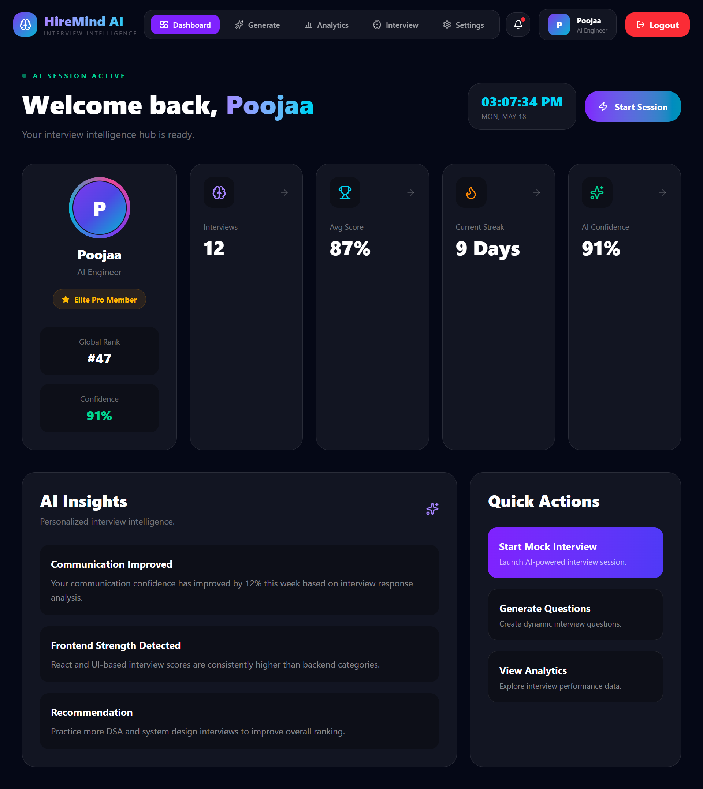
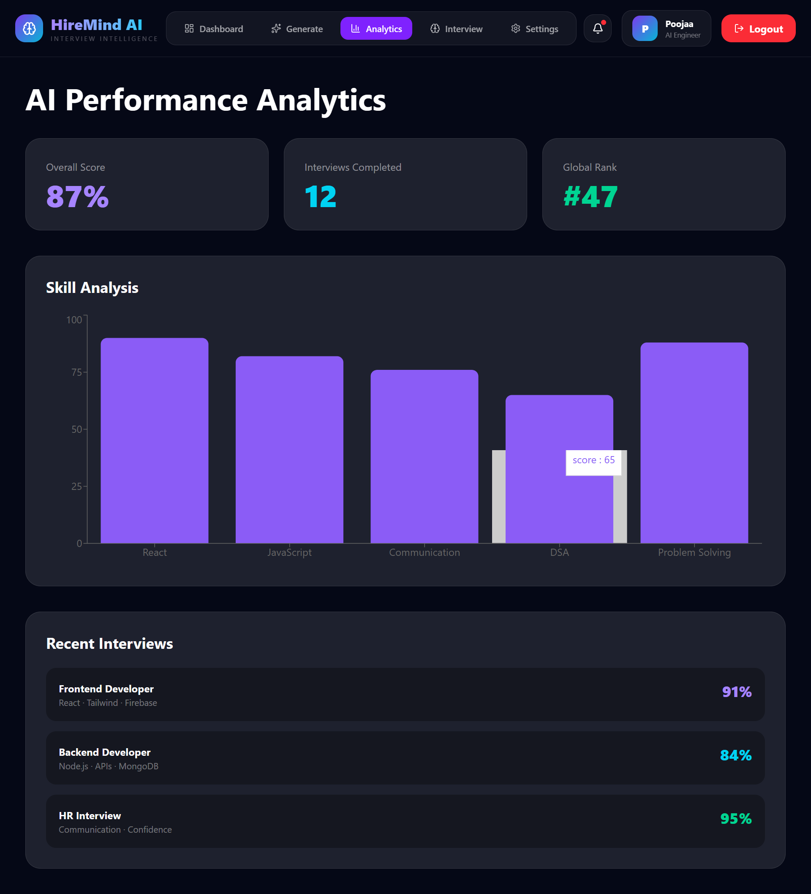
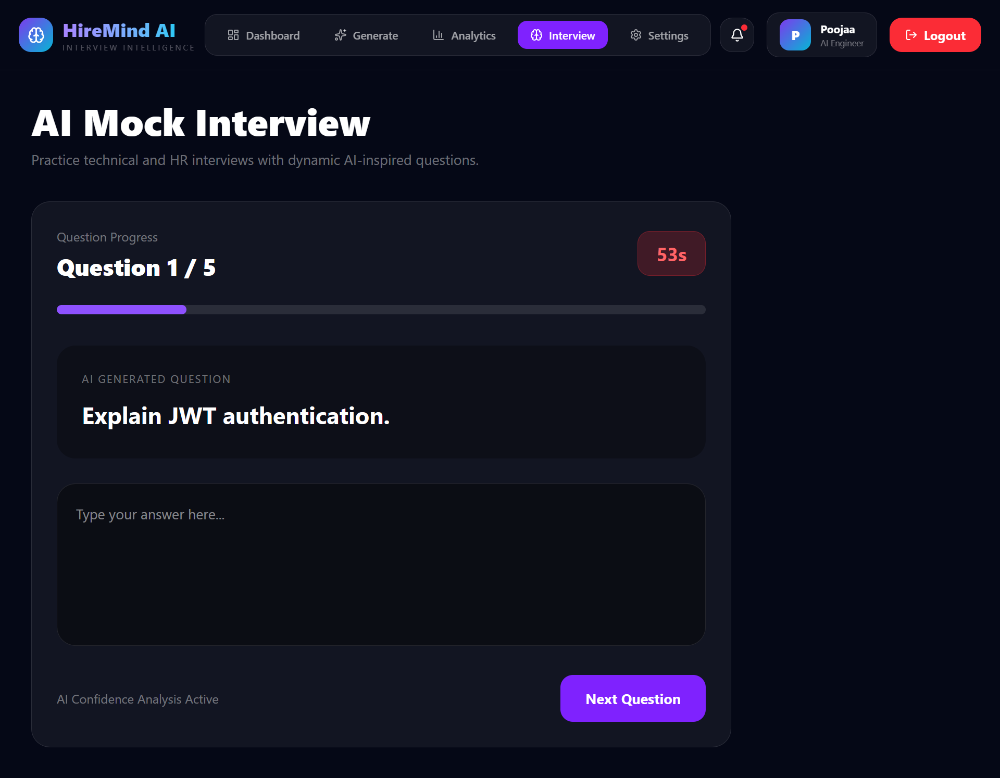
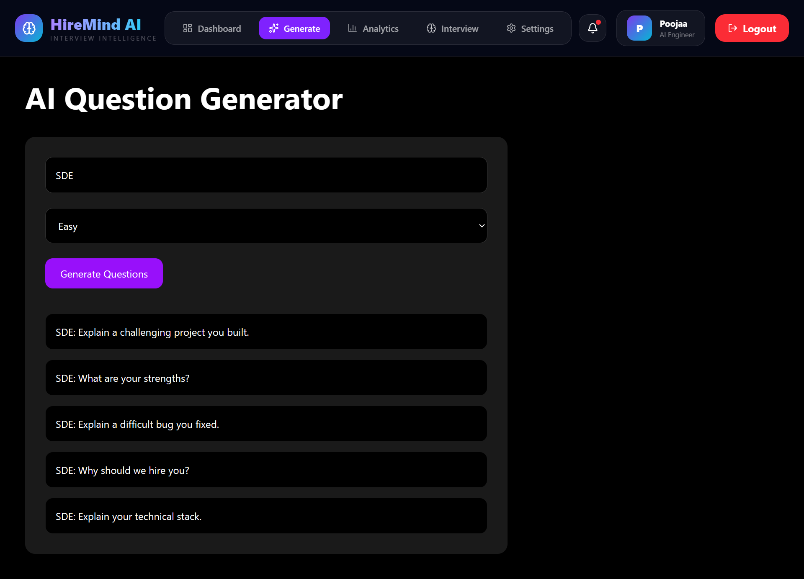
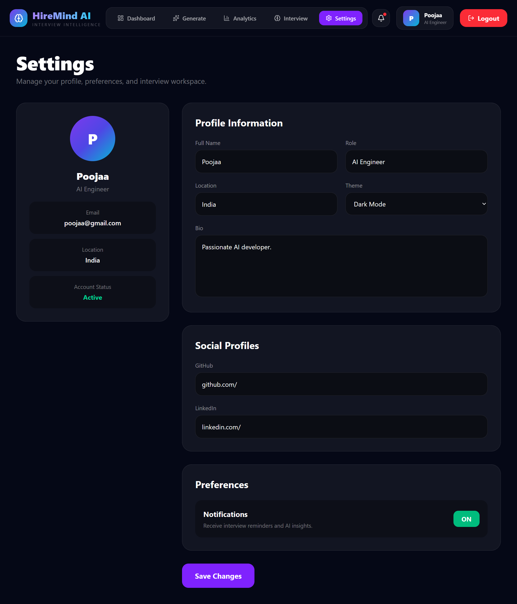

# HireMind AI

AI-powered mock interview preparation platform built using React, Firebase, Tailwind CSS, and Framer Motion.

---

## Live Demo

https://hiremind-ai-six.vercel.app/

---

# Features

- Firebase Authentication
- Login & Signup System
- Protected Routes
- AI Mock Interview UI
- Interview Question Generator
- Analytics Dashboard
- Professional Settings Page
- Animated Modern Dashboard
- Responsive SaaS-inspired UI
- Persistent Authentication
- Framer Motion Animations
- Dark Futuristic Theme

---

# Tech Stack

## Frontend

- React.js
- Tailwind CSS
- React Router DOM
- Framer Motion
- Recharts
- Lucide React

## Backend / Services

- Firebase Authentication

## Deployment

- Vercel

---

# Screenshots

## Dashboard



---

## Analytics Dashboard



---

## Interview Page



---

## Generate Page



---

## Settings Page



---

# Project Structure

```txt
src/
│
├── components/
│   ├── Navbar.jsx
│   └── ProtectedRoute.jsx
│
├── context/
│   └── AuthContext.jsx
│
├── pages/
│   ├── Analytics.jsx
│   ├── Dashboard.jsx
│   ├── Generate.jsx
│   ├── Interview.jsx
│   ├── Login.jsx
│   ├── Settings.jsx
│   └── Signup.jsx
│
├── assets/
│   └── screenshots/
│
├── firebase.js
├── App.jsx
├── main.jsx
└── index.css
```

---

# Installation

Clone the repository:

```bash
git clone https://github.com/poojaaxx/hiremind-ai.git
```

Move into the project directory:

```bash
cd hiremind-ai
```

Install dependencies:

```bash
npm install
```

Start development server:

```bash
npm run dev
```

---

# Environment Variables

Create a `.env` file in the root directory:

```env
VITE_FIREBASE_API_KEY=your_api_key
VITE_FIREBASE_AUTH_DOMAIN=your_auth_domain
VITE_FIREBASE_PROJECT_ID=your_project_id
VITE_FIREBASE_STORAGE_BUCKET=your_storage_bucket
VITE_FIREBASE_MESSAGING_SENDER_ID=your_sender_id
VITE_FIREBASE_APP_ID=your_app_id
```

---

# Current Status

This project is currently under active development.

The application has working authentication, protected routes, dashboard UI, interview simulation, analytics visualization, and profile management.

Some advanced functionalities are currently frontend prototypes and will be integrated fully in future updates.

---

# Current Limitations

- Mobile responsiveness is partially optimized
- Analytics currently uses demo/mock data
- AI evaluation system not integrated yet
- Some buttons and settings are UI-only
- No backend database storage for extended profile data
- Interview generation currently uses predefined logic

---

# Future Improvements

## AI Features

- Gemini/OpenAI integration
- AI-generated interview feedback
- Resume analysis
- Personalized learning recommendations
- Voice interview simulation

## Backend Features

- Firestore Database Integration
- Save Interview History
- Real Analytics Tracking
- Account Deletion System
- Cloud Data Persistence

## UI/UX Improvements

- Full Mobile Responsiveness
- Theme Customization
- Better Animations
- Notification System
- Real-time Updates

## Advanced Features

- Webcam Interview Mode
- Speech-to-Text
- Coding Assessments
- Company-Specific Interview Sets
- Leaderboards & Rankings

---

# Deployment

The project is deployed using Vercel.

Live App:

https://hiremind-ai-six.vercel.app/

---

# Author

## Poojaa D V

GitHub:
https://github.com/poojaaxx

---

# License

This project is created for educational, portfolio, and learning purposes.